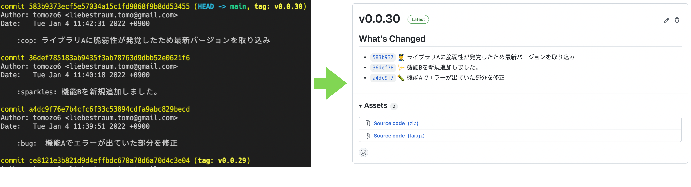

# create-release-notes

"最新のタグ" と "一つ前のタグ" 間のコミットメッセージからリリースノートを作成します。

## demo



## Inputs

## Outputs

|Name|Description|
|:--|:--|
|RELEASE_NOTES|リリースノートの内容|

## Requirements

- [actions/create-release](https://github.com/actions/create-release)と一緒に使用することを想定しています。

## Usage

### 一般的な使用方法

タグ付けされた際に発動するように設定します。

```yaml
on:
  push:
    tags:
      - "*"

jobs:
  Release:
    runs-on: ubuntu-latest
    name: Release
    steps:
      - name: Checkout
        uses: actions/checkout@v2
        with:
          fetch-depth: 0

      - name: Create Release Notes
        uses: tomozo6/create-release-notes@v2.0.0
        id: create-release-notes

      - name: Create Release
        uses: actions/create-release@v1
        env:
          GITHUB_TOKEN: ${{ secrets.GITHUB_TOKEN }}
        with:
          tag_name: ${{ github.ref }}
          release_name:  ${{ github.ref }}
          body: |
            ${{ steps.create-release-notes.outputs.RELEASE_NOTES }}
          draft: false
          prerelease: false
```
